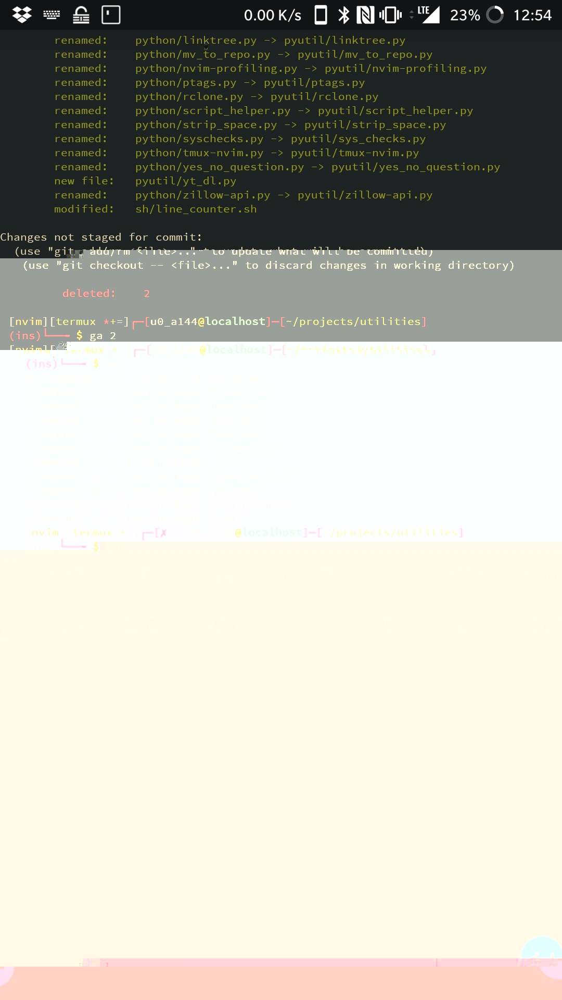

# Dotfiles

A repository that hosts the dotfiles for my Ubuntu workstations and a Termux
development environment.

Most of the code here is helper code that aides my productivity while I'm
working on various personal projects.

Enjoy reading through the code, feel free to take anything that interests you,
and leave a comment or open an issue if you notice anything that you'd
personally improve!

## Features

Currently this houses code for dozens of applications with a focus on python
programming and conventional Unix terminal workflows.

In addition, global configurations for [git](./unix/.config/git)
and [Anaconda](./unix/.condarc) exist.

A configuration for [Tmux](./unix/.tmux.conf) exists as well.

These configurations exist primarily for Linux only platforms as there
are extensively commented files for [Xmodmap](./unix/.Xmodmap),
[.xbindkeys](./unix/.xbindkeys), [.Xresources](./unix/.Xresources),
[.xsession](./unix/.xsession); however, to the maximum extent possible, the code
has been made portable to Windows.

## License

MIT
